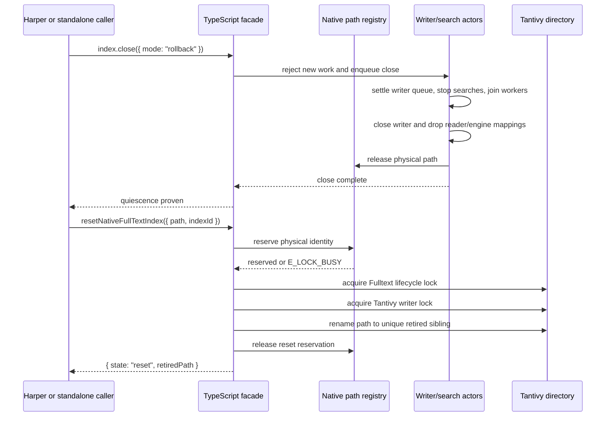

# Native reset and quiescence

## Intent

Harper must be able to retire an unusable local Tantivy index and rebuild it from authoritative
records without adding writer acquisition or recovery machinery to the shared derived-index
runtime. Standalone callers need the same safe operation. This change strengthens the existing
native close contract and adds one path-scoped reset operation; it does not add a generation
catalog, replication behavior, source-log interpretation, cleanup scheduler, or query-readiness
policy.

## Invariant

Once native close or reset resolves, no writer, reader, search actor, merge thread, queued command,
memory mapping, or registry reservation from the completed operation can still use the live
physical index path.

## Lifecycle baseline

- `NativeFullTextIndex.close()` delegates to `__nativeClose` and resolves from the writer command's
  callback (`ts/native.ts`, `src/native.rs`).
- The close command drains the search queue, joins the search workers, closes the writer, removes
  the path from the process registry, and then completes the callback (`src/native.rs`). The writer
  thread still owns its `Arc<Runtime>` at callback time, and `Runtime` owns the `Engine` and
  `IndexReader`; therefore callback completion is not currently proof that all mappings were
  dropped.
- The process registry rejects a second live writer for the same canonical physical directory.
  Environment cleanup force-closes tracked handles and waits on their completion signals
  (`src/native.rs`). Tantivy's writer lock excludes established writers across processes; this
  change adds a Tantivy-directory lifecycle lock to also cover the interval before open acquires
  its writer lock.
- `inspectNativeFullTextIndex()` is synchronous and read-only. It validates native identity,
  schema, metadata, and checkpoint payload without registering a handle or acquiring a writer
  (`ts/native.ts`, `src/native.rs`, `src/engine.rs`).
- Harper's derived-index runtime already treats backend shutdown as the owner handoff barrier.
  Harper decides whether to reuse, replay, rebuild, activate, or clean up derived state; the wrapper
  owns only native resource safety.

## Public contract

```ts
interface NativeFullTextIndexResetOptions {
	path: string;
	indexId: string;
}

type NativeFullTextIndexResetResult = { state: 'missing' } | { state: 'reset'; retiredPath: string };

function resetNativeFullTextIndex(options: NativeFullTextIndexResetOptions): Promise<NativeFullTextIndexResetResult>;
```

The operation has the following behavior:

- A missing path returns `missing` without creating files.
- An open, opening, closing, or already-resetting physical index rejects with `E_LOCK_BUSY`. Reset
  never force-closes a handle owned by another caller or Node environment.
- A caller closes its owned handle first. The strengthened close resolution is the proof of native
  quiescence.
- Reset accepts an empty directory or one containing only the Tantivy writer/meta lock markers and
  the Fulltext lifecycle-lock marker. Any other content requires a valid Fulltext identity sidecar,
  and its logical index ID must match `indexId`; unreadable or malformed sidecars fail closed.
  Schema and generation differences remain valid reasons to reset. It rejects a filesystem root, a
  symbolic-link path, and a directory that does not have this shape.
- Reset reserves the existing physical-directory identity in the process registry, acquires the
  wrapper's nonblocking lifecycle lock, and then acquires Tantivy's nonblocking writer lock. It
  renames the directory into the parent's hidden `.fulltext-retired` directory, drops its locks and
  directory handles, releases the registry reservation, and returns the retired path. The name
  includes the source basename, process ID, monotonic operation ID, and nanosecond timestamp; an
  existing candidate is skipped with a bounded retry rather than replaced.
- A caller may immediately open a new empty index at the original path. The wrapper never deletes
  the retired tree; Harper schedules bounded cleanup, while a standalone caller may remove the
  returned path when appropriate.
- Filesystem failures return `E_STORAGE`. A rename that did not complete is never reported as
  success. A successful rename is the reset publication point and leaves a recognizable retired
  sibling rather than a partially deleted live path. Reset does not fsync the containing directory;
  crash durability of that directory entry remains caller and filesystem policy.

The native request receives its own protocol frame and the native ABI advances with the new addon
capability. The TypeScript loader verifies the symbol before exposing the operation.

## Native lifecycle



`Engine` and `IndexReader` ownership moves from the shared `Runtime` object to the actors that use
them. Search workers receive clones of the same engine and reader when they start. The writer actor
holds the same reader for publication reload and retains one engine reference solely to prove final
drop ordering. Close joins search workers, verifies that only the writer's references remain, drops
the writer and reader/engine references, then releases the path and completes. All orderly, panic,
and queue-closed writer exits use this teardown. This adds no lock, allocation, or shared-state
lookup to a search.

The registry's existing physical-directory entry becomes a reservation state:

```text
vacant -> open(handle) -> vacant
vacant -> resetting    -> vacant
open(handle) -> unproven(path quarantine) -> process restart
```

The transition is made under the existing registry mutex, but canonicalization, metadata reads,
locking, and rename run outside it. Existing canonicalization and physical identity checks continue
to collapse supported aliases. Rename is the critical property: an opener that observes the old
directory before publication sees the lifecycle or writer lock; an opener after publication creates
a new directory that reset never deletes. Open acquires the lifecycle lock before computing and
reserving the physical identity. On Unix, the inode re-check after reservation is an additional
defense against a changed path. On Windows, the lifecycle lock is the cross-process handoff barrier
and the normalized canonical path is the in-process alias key. The lifecycle lock uses Tantivy's
supported custom `Directory` lock primitive, not a second locking implementation. Every process
that can open or reset the path must use this ABI version; the loader rejects an older addon in the
current process.

Reset work uses a synthetic operation handle and the existing Node-environment cleanup tracking. If
environment teardown wins before reservation, reset is cancelled without mutation. Once the path is
reserved, teardown waits for the bounded rename operation to finish. An RAII reservation guard
releases registry and cancellation state after ordinary failure, thread panic, or callback loss.
A spawn failure is handled before any path reservation exists.

Reset keeps both lifecycle and writer locks through rename on every platform. Windows is a required
CI gate; there is no unlock-before-rename fallback because that would admit an external opener or
writer into the handoff window. A sharing violation fails without publication and is surfaced as
`E_LOCK_BUSY`. `EXDEV`, mount-point rename, and permission failures surface as `E_STORAGE`; Harper
leaves the index unready and requires path or operator remediation rather than falling back to
in-place deletion.

## Failure and ownership rules

- `E_LOCK_BUSY` is a retryable ownership/quiescence result, not corruption and not permission to
  rebuild through a live owner.
- A failed close does not prove quiescence. Tantivy 0.26.1 can return early from
  `wait_merging_threads()` after an indexing-worker failure without joining every remaining worker.
  The wrapper therefore removes the unusable handle and quarantines its canonical path until process
  restart. The quarantine is deliberately path-scoped so another index using the same logical ID is
  unaffected. Callers must not rename or remove an unproven directory; external filesystem mutation
  is outside this lifecycle protocol and cannot establish safety. Harper keeps the affected index
  unavailable; availability is not allowed to weaken the file-lifetime invariant.
- Close has no internal timeout. Resolving while a writer or merge thread may still own files would
  violate the barrier. Node-environment cleanup logs after its bounded wait, while process shutdown
  remains the hard-stop mechanism for a native thread that never returns.
- A directory containing `meta.json` without the identity sidecar fails closed. Current creation
  writes and syncs the sidecar before Tantivy metadata, so this state cannot identify the index that
  owns it and is not safe for reset to retire automatically.
- Reset does not interpret or validate checkpoint payloads. Inspection remains the cursor and
  compatibility boundary.
- Reset does not select or delete a retired generation, open a new writer, or make queries ready.
  Harper follows its ordinary rebuild path after reset; standalone callers may open the live path.
- Reset is not secure erasure. It publishes retirement with a same-filesystem rename; durability of
  the containing directory and eventual deletion remain caller policy.
- The registry mutex remains a brief process-global lookup on native admission, as it is today, but
  no filesystem or Tantivy operation runs while it is held. Work on one index does not wait behind
  another index's close or reset execution.

## Boundary rationale

The wrapper retires the live directory with a same-filesystem rename instead of deleting it in
place. This avoids recursive deletion overlapping a new directory created at the same path, creates
one publication point, and keeps deletion recoverable. Reset never force-closes by path because a
caller cannot prove it owns a handle opened by another Node environment. It also does not wait or
retry; Harper already owns that policy, and `E_LOCK_BUSY` is sufficient for standalone callers.

Reset checks the logical `indexId`, but not the full schema or generation. Schema and generation
incompatibility are reasons to rebuild; requiring them to match would block the repair operation.
Generation selection and cleanup remain outside the wrapper so this API does not introduce another
durable catalog alongside Tantivy `meta.json`.

## Verification

- Real-addon tests publish, close, reset, inspect as missing, restore the retired directory, reopen,
  and verify both the checkpoint and searchable document.
- Repeated commits create merge work before close, followed by immediate retirement and recursive
  removal. This exercises the intended sequence but does not by itself prove operating-system file
  lifetime behavior.
- Reset of a live index is rejected without changing its data. A separate process proves writer-lock
  exclusion, closes its handle, stays alive, and then permits reset. A Rust test independently proves
  lifecycle-lock contention and release across directory handles.
- Missing and empty paths, logical identity mismatch, unrelated directories, source and destination
  symbolic links, and retirement-destination failure are covered. The failure test reopens the same
  path afterward to prove the registry reservation was released.
- Existing Rust, publication, poison, admission, crash-recovery, worker-cleanup, packaging, and
  benchmark-smoke suites remain part of CI. Windows CI is required before release because local
  development cannot prove its mapping and sharing behavior.

The end-to-end route is the package's Node test suite against the built N-API addon. It exercises
the public TypeScript API through the Rust registry, Tantivy lock, and real filesystem rename rather
than substituting a mock directory.
