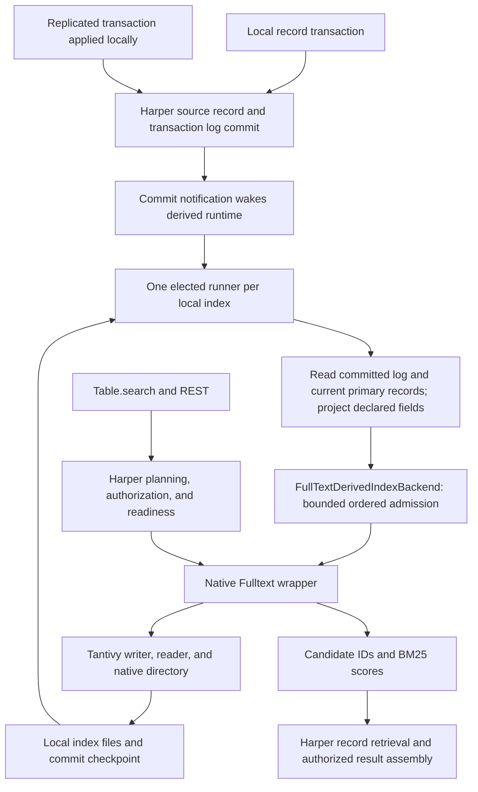
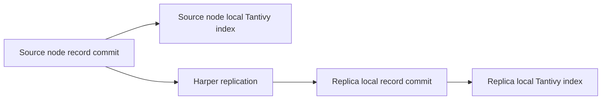
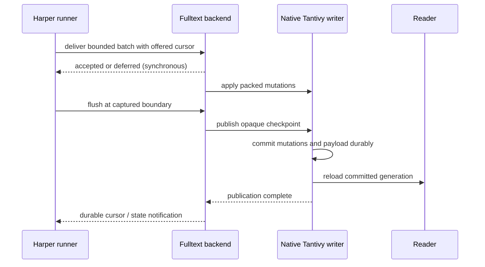

# Native Tantivy storage and Harper derived indexes

Status: approved storage direction; implementation and qualification remain open. Updated September 14, 2026.

## Scope

`@harperfast/fulltext` uses Tantivy's native filesystem storage (`MmapDirectory`) for both standalone
Node.js applications and Harper. Harper records remain authoritative. Each Harper node builds and
maintains its own local index from its locally committed records through the shared derived-index
runtime. Neither index files nor checkpoints are replicated between nodes.

This replaces the plans for a Harper-backed Tantivy Directory, a storage request/response transport,
and a standalone rocksdb-js data source. The wrapper needs no rocksdb-js dependency, private provider,
native storage lease, or Harper-specific storage factory. Existing experimental implementations and
their benchmark results remain historical evidence; they are not release requirements.

Local index files survive ordinary restarts. Harper reopens a compatible generation and replays from
its saved checkpoint. Missing, corrupt, incompatible, or unresumable state triggers a local rebuild.
A fresh replica or restore without reusable index files rebuilds before accepting full-text queries.
Authoritative data and schema are sufficient for backup/restore; index snapshots are outside the
initial scope. Ordinary Harper service can start while full-text readiness is pending, subject to
Harper's existing admission and resource policies.

This changes storage, deployment, recovery qualification, and benchmarks. It does not change the
agreed schema and query scope: `@fullText`, English analysis, weighted BM25, Boolean/phrase/prefix/
fuzzy matching, autocomplete, configurable positions and surface terms, and optional synonyms and
highlighting disabled by default. Harper continues to expose search through `Table.search()` and REST.
These are feature requirements, not claims that every query feature is implemented today.

## Architecture





The second diagram shows eventual maintenance, not synchronous work inside the commit. Source and
replica indexes have independent writers, publication timing, local log checkpoints, and readiness.
Replication completion is not an acknowledgement that either index is searchable. A replica indexes
the locally accepted winning record state, never an uncommitted incoming transaction payload.

| Responsibility                                                                      | Owner                              |
| ----------------------------------------------------------------------------------- | ---------------------------------- |
| Records, conflict resolution, replication, schema, authorization                    | Harper                             |
| Log iteration, exact resume, projection, rebuild scan, ownership epochs, lag policy | Harper derived-index runtime       |
| Ordered engine admission, checkpoint adaptation, recovery notifications             | Harper FullTextDerivedIndexBackend |
| Native handles, packed ABI, bounded execution, errors, commit/reload                | Fulltext wrapper                   |
| Index format, postings, dictionaries, BM25, segments, merges, filesystem durability | Tantivy                            |
| Index root, generation selection, database lifetime, activation, cleanup            | Harper integration                 |

The wrapper treats a checkpoint as an opaque bounded payload. It does not parse Harper logs, order
cursor vectors, create a retry journal, or implement replication, retention, or another election.

## Source grounding and implementation gap

The September 14 source pass used Fulltext `7085d394e77f1cf9f59dcd7f63b23088450d2d35` and Harper
`55691f500` fetched from their main branches. The following statements describe those revisions:

- Fulltext `ts/native.ts` provides native open, batched apply, commit, reload, search, status, and
  close. It does not yet expose native checkpoint publication/readback.
- Fulltext `src/engine.rs` already reads committed payloads and prepares commits with payloads.
  The experimental hosted runtime in `src/native.rs` and `ts/harper.ts` supplies publication and
  ambiguous-publication handling to reuse, without carrying its storage provider into native mode.
- Harper `resources/derivedIndexRuntime.ts` owns lock-elected transaction-log runners, bounded
  progress, replay/rebuild, and readiness. Record commits are wake-ups; runners perform delivery.
- The backend in the draft Harper change supplies a structural `apply`/`publish`/`close` engine
  contract. Native publication is the next dependency for using that backend with real local files.

Verify these anchors again during implementation. Prior hosted-storage measurements do not prove
native Harper performance, and deterministic backend tests do not prove real native handoff.

## Commit, checkpoint, and visibility

The invariant is: every checkpoint reported durable to Harper belongs to a complete committed
Tantivy generation covering the accepted work at that boundary. No acknowledged checkpoint may
claim work that only existed in a queue or uncommitted writer buffer.

The cursor describes completed delivery through a boundary, not a transactionally exact snapshot:
Harper's current-state projection can include newer record state. Replay remains idempotent by ID.
Harper retains log-retention policy; checkpoint acknowledgement does not independently authorize
purging history. Rollback to an older commit with unavailable history requires rebuild, never
resume from the oldest remaining log as a substitute.

Proposed addition to the existing native facade:

```ts
interface NativePublication {
	readonly committedPayload?: string;
	publish(payload: string): Promise<bigint>;
}
```

`publish` runs in the existing serialized writer lane. It commits preceding accepted mutations and
the supplied opaque payload together, then reloads the reader before resolving. A successful result
proves both durable publication and local reader visibility. The payload read on reopen is the
Tantivy commit payload, not an independently advanced RocksDB row or sidecar cursor file. Payload
encoding, size limits, and status additions must be versioned and validated on both sides of the ABI.



Preserve standalone `commit()` and `reload()` behavior for existing uncheckpointed callers. Once a
generation has a committed payload, plain `commit()` rejects with a typed error; further commits
must use `publish(payload)`. Enforce this after reopen too, preventing accidental checkpoint erasure
without interpreting the payload. Check this in the serialized writer actor at execution, not only
at enqueue: a queued publication may establish the payload before a following plain commit executes.
Payload readback throws while publication is uncertain; an absent
payload denotes an uncheckpointed generation, not an uncertain one. Harper uses publication
exclusively. A failed reload after a successful
commit is an ambiguous publication, not permission to keep mutating the same uncertain generation;
close/reopen and report recovered progress through the existing backend recovery path.
Use reopened commit metadata to resolve progress, never queued/uncommitted counters from a poisoned
handle. A reload failure alone is not grounds for rebuild when the reopened generation validates.

The authoritative store and Tantivy do not share a transaction. A crash after source commit but
before publication is repaired through Harper replay. On reopen, Harper validates every saved source
boundary. A source restore, lost log, or source durability rollback that invalidates the checkpoint
requires rebuild; the index cannot be used as proof that a missing source write committed.

Empty source batches may advance the replay cursor without native document application. Publication
still costs a filesystem commit. Reuse the backend's bounded flush policy and measure cursor-only
traffic, including workloads that write only unrelated tables. Do not introduce a new timer or
checkpoint policy merely because storage changed.

## Writers and multiple indexes

Tantivy permits one exclusive `IndexWriter` per physical index directory. That writer owns segment
publication and coordinates its internal indexing and merge threads. It does not mean a single
global writer, one CPU thread, or permanent ownership by Harper worker 0.

Harper elects one owner per logical index. The wrapper and Tantivy enforce the physical-directory
writer lock as a second guard. Independent indexes may write concurrently, including an active and
rebuilding generation when resources permit. Path aliases must resolve to the same ownership
identity. Directory lock contention must not trigger destructive recovery of another live writer.

Native work stays off the JavaScript event loop and shared libuv pool. Bound admitted commands,
bytes, resident writers, indexing/merge threads, search work, and rebuilding generations across the
process. Existing per-index limits do not prove aggregate limits. Retained searchers and file mappings
also count. Preserve query, close, and recovery progress during sustained ingestion.

Native queue saturation must map into Harper's bounded deferral/retry contract. Do not lose a batch
or turn capacity pressure into permanent failure. Verify which layer owns an accepted batch when
native admission rejects before application.

Ownership handoff stops admission, joins or rolls back accepted work, and proves native quiescence
before releasing the Harper owner lock. The next owner reopens and validates the committed payload.
A deadline or worker exit does not prove native tasks stopped. Test real Node worker loss and native
writer release; do not replace Harper ownership with a wrapper lease service.
If shutdown cannot prove quiescence, surface the failure and keep the generation unavailable for
writer reuse. A cleanup timeout that only logs to stderr is insufficient proof of safe handoff.
Recovery may require process restart to release native ownership.
Preserve a distinguishable retryable acquisition/quiescence failure while a prior owner is draining;
it must not be mistaken for corruption or trigger deletion/rebuild of a live writer's directory.

Reader attachment across Harper workers is implementation work: reuse a process-shared native
handle/reader registry if qualified, or qualify reader-only attachments. Do not open a writer in
every query worker. Readers must observe published generations without filesystem polling or reload
on each query. Cross-worker publication visibility is a release test, not implied by owner reload.
Generation discovery must also recover when commit succeeds but the publishing owner dies before
sending its notification. Reacquisition/recovery must reconcile readers with the committed state.
Measure reader metadata, handles, mappings, and physical resident memory separately: Node workers
share a process and file-backed pages may be shared; extra readers do not imply a full private copy
of the index, but their actual memory and refresh costs still require a bound.

## Restart, replica bootstrap, and generation lifecycle

1. Harper resolves the local database lifetime, index identity, schema fingerprint, and selected
   generation under an operator-owned index root. Customer record values never become paths.
2. The elected owner opens the native directory and checks identity, format compatibility, and
   commit payload before declaring readiness.
3. If state and exact source-log boundaries validate, Harper replays from that checkpoint using
   the same runner as normal delivery.
4. Otherwise Harper builds a replacement generation from a consistent source boundary, catches up
   through its existing rebuild/replay protocol, publishes, and activates it only when ready.
5. Retired generations are removed only after writers, native tasks, readers, and mappings release
   them. Interrupted builds are identified by their exact generation identities and cleaned safely.

A new replica must coordinate with Harper's existing initial data-copy lifecycle. Do not assume all
bootstrap rows pass through normal audited live-transaction delivery. Verify the base-copy boundary
and final catch-up against real replication before enabling search. A snapshot received from another
node cannot reuse that node's cursor because cursor identities are local.

Files persist across ordinary node restarts. Restoring a source database invalidates previous local
index identity even if paths or record IDs match. Default backup/restore includes authoritative data
and schema and rebuilds local indexes. Raw copies of live Tantivy directories are not a supported
index backup. A future snapshot transfer is a separate feature with consistent snapshot, identity,
checkpoint translation/validation, and catch-up requirements.

Harper coordinates generation selection and activation; the wrapper does not add an independent
catalog. The selection protocol must tolerate crashes between creating files, committing them, and
updating Harper metadata. File existence alone is never readiness. Reuse existing generation
lifecycle facilities where available; verify any missing activation boundary before implementation.
Harper's restore lifecycle must rotate the local database incarnation used in the native generation
identity, even when restoring the same logical database. Restored activation metadata is not proof
that old local index files belong to the restored source. Verify the existing restore hook and fail
closed if this fence cannot be established; the wrapper's opaque generation string is sufficient.

Missing or rebuilding initial indexes return the established full-text unavailable response, not
an empty successful result or an unbounded table scan. A compatible previously active generation
may serve only under Harper's existing bounded stale-reader policy. Schema changes and restore must
not make incompatible old results eligible. Source admission remains Harper policy: native work is
not awaited by source commits, but an enabled lag guard may reject new writes before commit.

## Files, deployment, and security

Tantivy stores term dictionaries, postings, frequencies, optional positions, document identifiers,
deletion state, field statistics, and index/segment metadata in files. Configured stored content can
add original text. Derived files are sensitive even when original source fields are not stored.

- Use a persistent local filesystem supported by the pinned Tantivy version; initial qualification
  targets local SSD/NVMe. Shared network filesystems and two nodes sharing one writer directory are
  outside scope. An ephemeral volume is valid only with the understood rebuild cost on replacement.
- Harper chooses the index root and generated subdirectory identities. Storage paths and durability
  knobs are operator/runtime settings, never `@fullText` schema or REST input.
- Enforce restrictive permissions. RocksDB encryption does not encrypt Tantivy files; deployments
  requiring encryption must protect the index volume/filesystem as well. No custom encryption
  Directory is part of this change.
  Harper creates and validates owned directories with restrictive platform permissions and path
  containment, including generated identities for customer-supplied table/index names. Standalone
  callers retain ordinary relative-path support. Harper public errors expose stable codes and safe
  messages; filesystem paths stay in protected operator diagnostics, not REST results.
  Precreate Harper-owned directories securely and check canonical containment, including symlink
  resolution, before opening and before cleanup. Do not rely on umask-default recursive creation
  by the standalone opener. Test permissions and platform path aliases in the Harper integration.
- Budget active files, merge output, rebuilding generations, retained searchers, and temporary disk
  headroom. If index and source data share a device, they still contend for I/O and free space.
- Check headroom before admitting writers/rebuilds and apply supported Tantivy merge policy limits.
  Account for already-running merges; neither a free-space check nor an assumed 2x multiplier is a
  reservation. Measure peak usage under concurrent merges and rebuilds and preserve a safety margin.
- Reserve authoritative-store disk headroom and expose pressure and ENOSPC. Pause/reject derived
  admission under Harper's existing policy; never acknowledge a checkpoint after failed sync.
- Table/database drop, index removal, restore, and schema replacement fence queries and writes before
  closing and deleting exact owned generation paths. Qualify Windows mapping/deletion behavior as
  well as POSIX behavior. A failed cleanup leaves an observable orphan, not a reused live directory.
  Retry cleanup in bounded work across restart using lifecycle metadata or safely rediscovered
  unreferenced generations; do not rebuild the retired KV chunk collector for filesystem storage.

RocksDB remains the initial Harper source-store target because the shared runtime and eviction/replay
integration are qualified there. Moving Tantivy files out of RocksDB does not automatically make
LMDB supported; keep an actionable unsupported-runtime error until that integration is qualified.

## Testing and performance

Reuse Tantivy's Directory implementation rather than rebuilding its conformance suite for a custom
KV layout. Test the wrapper contracts, native filesystem lifecycle, and the actual Harper integration.
Keep reusable test-only fault injection when retiring KV production code; preserve panic-boundary
and unwind-profile checks. Index poisoning remains fail-closed until a separate review proves a
particular query failure is isolated from shared native state.
Retain the test-only wrapped native Directory route for failed commit and failed reload coverage;
removing production KV code must not remove the ability to reach those failure branches.

Required correctness coverage includes native opaque payload round-trip; upsert/delete/recreate;
exact result-ID parity after replay; crash before apply, after apply, after commit, and before reload;
worker handoff/loss; missing/corrupt files; source restore; retention gaps; replicated writes and
initial replica copy; eviction; multi-index pressure; generation replacement; close/drop; and format
upgrade/rebuild. Cursor-only changes must not cause document application. Process-kill tests prove
process-crash behavior, not power-loss durability; qualify sync ordering and power-loss behavior
separately on supported filesystems.

Benchmark three deployment paths:

| Path                                    | Question                                                           |
| --------------------------------------- | ------------------------------------------------------------------ |
| Standalone native wrapper               | Engine and binding throughput, latency, memory, disk, and recovery |
| Harper with no full-text index          | Cost and latency of the same authoritative workload                |
| Harper derived runtime + native wrapper | Full integration performance, freshness, and impact on Harper      |

These are two uses of one storage backend plus a no-index control, not three data sources. Remove
Rocks Directory/WAL-only/root-flush comparisons from release gates. Keep old results explicitly
identified as historical experiments. Match corpus, analysis, mutations, publication cadence, query
mix, and hardware when comparing compatible measurements; end-to-end Harper differences include
record writes, projection, replay, authorization, and retrieval, not just wrapper overhead.

Run fixed-arrival and saturation profiles with deterministic corpora, heavy-tail text sizes,
realistic selectivity, updates/deletes, warm/cold caches, multiple indexes, replica catch-up, and
background merges/rebuilds. Record achieved throughput and backlog drain together. Report query
p50/p95/p99 by class, source-write and replication latency, indexing lag, queue wait, commit/reload,
event-loop delay, CPU, RSS/mapped memory, disk use/I/O, errors, recovery, and rebuild time.
Measure binding overhead and copies before native enqueue separately from native execution. Do not
add persistent callbacks, new pools, or new batching infrastructure without measured justification.

The catalog goal remains hundreds of millions of records and end-to-end query p99 below 50 ms on an
agreed workload. Native filesystem storage is a performance rationale, not measured proof of that
goal. Text-size distribution, QPS, update rate, hardware, query mix, and rebuild-time objective are
still needed for capacity planning. The existing steady-state freshness objective remains one second
at p99, with recovery and overload reported separately.

PR CI runs correctness and benchmark-output smoke. Scheduled/release runs use controlled hardware
and store versioned JSON plus immutable workload/environment/revision fingerprints in GitHub.
Release comparisons require compatible cohorts; machine paths, source text, and raw error contents
are excluded from publishable results. Cross-repo Harper integration must become a reproducible CI
fixture; a manually supplied local build is not release coverage.
Give that fixture a pinned Harper revision and its own CI job/cache/timeout appropriate to the build.
Retire the KV benchmark CI step with the unsupported storage code instead of relabeling it native.

## Implementation sequence

1. Add generic native checkpoint publication/readback by reusing existing engine and hosted
   publication code. Test durability, reload ambiguity, and compatibility with standalone callers.
2. Wire the Harper backend's lifecycle collaborator to native open/publish/close. Preserve its
   existing ordering, fencing, and recovery behavior. Establish local path/generation ownership and
   cross-worker query visibility through the smallest real integration slice, with a reproducible
   cross-repo fixture required for that slice's acceptance.
3. Adapt the existing benchmark PR to the native paths above and automate restart/replay and worker
   handoff before interpreting throughput. Keep both current Harper PRs draft during this work.
4. Remove hosted storage exports, transport, KV Directory/reclamation code, release dependencies,
   and obsolete tests in a separate audited cleanup. Keep git history and historical benchmark
   evidence. The native package, README, examples, runtimeInfo, and install tests must agree that
   native is the only supported datasource.
   Audit Cargo feature flags, Node-API enablement, addon-loader validation, panic-test features, and
   runtime-info codecs together so removing host-storage cannot produce an addon with missing exports.
   In particular, change Rust capabilities, TypeScript runtimeInfo and loader validation together,
   and detach test-panic/Node-API enablement from the removed host-storage feature.
5. Complete schema/query/lifecycle integration and qualification using the existing tracked work.
   Ship supported platform artifacts, documentation, release history, and Apache-2.0 licensing.

## Approaches considered

| Axis            | Approach and disposition                                                                                                                                                                                                                                                                                                                    |
| --------------- | ------------------------------------------------------------------------------------------------------------------------------------------------------------------------------------------------------------------------------------------------------------------------------------------------------------------------------------------- |
| Different layer | Keep Tantivy objects inside RocksDB: rejected by the selected native-only storage scope; requires a Directory mapping and host I/O transport that native Tantivy already supplies.                                                                                                                                                          |
| Deeper cause    | Rebuild on every restart to avoid checkpoint integration: rejected because the approved restart contract reuses files and replays, and a catalog-scale scan on every restart defeats that contract.                                                                                                                                         |
| Do less         | Store a cursor separately after index commit: can be conservatively safe with idempotent replay and additional generation/rollback validation, but adds another durable state to reconcile. Native payloads already exist and travel with the generation they describe, including rollback. A cursor written before index commit is unsafe. |
| Chosen          | Native Tantivy files with payload-bearing commits and Harper-owned replay/rebuild. Existing engine payload support closes the required boundary without a new storage adapter.                                                                                                                                                              |

Dedicated search replicas and query routing would change the selected per-node indexing behavior
and are outside scope. Capacity planning must count a separate index and merge/rebuild budget on
each indexing node. Local BM25 statistics and publication timing can differ between nodes, so equal
source replication positions do not promise identical instantaneous scores or cross-node pagination.

For reader attachment, prefer reusing process-shared native reader state if its worker lifetime can
be proved. Reader-only attachments plus Harper lifecycle notifications are a candidate if shared
state cannot meet that contract; notification loss must recover through lifecycle reconciliation.
Directory-watch polling and per-query reload add visibility delay/I/O outside the selected refresh
contract. A separate search process introduces an IPC/deployment boundary not needed for this slice.
Freeze the reader choice only after the worker handoff/visibility fixture measures and validates it.

## Remaining decisions

The storage and restart/restore direction is settled. Workload sizing, acceptable rebuild time,
operator index-root/volume configuration, and the deployment encryption prerequisite remain to be
qualified. Reader attachment and crash-safe generation selection are engineering choices to verify
against current code. They must not introduce a second delivery or storage system.
